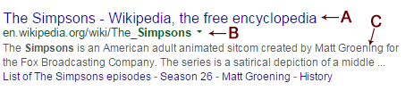

# Google: Parse a Page

A google SERP can contain different type of result.


Firstly they are divided in three distinct regions: natural (organic), paid (adwords) and graph results and each of them
has its own results types.

Through there is a great diversity of results the library gives you the api to work with them, here we explain
what are their differences.

# Natural Results

Natural results (aka organic results) are main results of the page.

Each natural result has a position and some available data. You can access them the following way (see the foreach loop):

```php
    use Serps\SearchEngine\Google\GoogleClient;
    use Serps\SearchEngine\Google\GoogleUrl;

    $googleClient = new GoogleClient($httpClient);

    $googleUrl = new GoogleUrl();
    $google->setSearchTerm('simpsons');

    $response = $googleClient->query($googleUrl);

    $results = $response->getNaturalResults();

    foreach($results as $result){
        // Here we iterate over the result list
        // Each result will have different data based on its type
    }
```

Each of the result from the loop will have the following methods available:

- ``getTypes()``: the types of the result
- ``is($type)``: check if the result is of the given type
- ``getDataValue($type)``: Get the given data from the result
- ``getData()``: Get the all the data of the result
- ``getOnPagePosition()``: Get the position of the result on the page (not aware of the pagination)
- ``getRealPosition()``: Get the global position of the result (aware of the pagination)

The difference between each result type is the list of data available with ``getDataValue($type)`` and ``getData()``.
See bellow for all available data per result type.

## Natural Result Types

**Result types** can be accessed through the class ``NaturalResultType``,

```php
    use Serps\SearchEngine\Google\NaturalResultType;

    if($result->is(NaturalResultType::CLASSICAL)){
        // Do stuff
    }

    // You can also check many types at once
    // Here we check if the result is classical or image group

    if($result->is(NaturalResultType::CLASSICAL, NaturalResultType::IMAGE_GROUP)){
        // Do stuff
    }

```

From the **resultSet** you can also access all the results matching the given type:

```php

    // Get all the results that are either classical or image_group
    $results = $results->getResultsByType(NaturalResultType::CLASSICAL, NaturalResultType::IMAGE_GROUP);

```


## Classical

These results are the common natural results that have always existed in google.




**Available with**

- ``NaturalResultType::CLASSICAL``

**Data**

- ``title`` <small>**string**</small> [**A**]
- ``url`` <small>**string**</small>: the url targeted on clicking the title
- ``destination`` <small>**string**</small> [**B**]: either a url or a breadcrumb-like destination
- ``description`` <small>**string**</small> [**C**]

**Example**

```php
    use Serps\SearchEngine\Google\NaturalResultType;

    $results = $response->getNaturalResults();
    
    foreach($results as $result){
        if($result->is(NaturalResultType::CLASSICAL)){
            $title = $result->getDataValue('title');
            $url   = $result->getDataValue('url');
        }
    }
```

## Classical Video

This type an extension of the [classical result](#classical), but it refers to a video result.

The video result can be illustrated with either a thumbnail or a large image.


**Available with**

- ``NaturalResultType::CLASSICAL_VIDEO``
- ``NaturalResultType::CLASSICAL``

**Data**

- ``title`` <small>**string**</small> [**A**]
- ``url`` <small>**string**</small>: the url targeted on clicking the title
- ``destination`` <small>**string**</small> [**B**]: either a url or a breadcrumb-like destination
- ``description`` <small>**string**</small> [**C**]
- ``videoLarge`` <small>**bool**</small>: true if the video is image is large (usually first result)
- ``videoCover`` <small>**string**</small>: the video picture as given by google - either an image url or a base64 encoded image

**Example**

```php
    use Serps\SearchEngine\Google\NaturalResultType;

    
    $results = $response->getNaturalResults();
    
    foreach($results as $result){
        if($result->is(NaturalResultType::CLASSICAL_VIDEO)){
            $title = $result->getDataValue('title');
            if($result->getDataValue('videoLarge'){
                // ...
            }
        }
    }
```


## Image Group

Images that appear as a group of results.


**Available with**

- ``NaturalResultType::IMAGE_GROUP``

**Data**

- ``images`` <small>**array**</small>: the list of images that compose the image group, each image contains:
    - ``sourceUrl`` <small>**Url**</small>: the url where the image was found
    - ``targetUrl``<small>**Url**</small>: the url reached on clicking the image
    - ``image`` <small>**string**</small>: the image data as specified by google (either an image url or a base64 encoded image)
- ``moreUrl`` <small>**Url**</small>: The url corresponding to the google image search

**Example**

```php
    use Serps\SearchEngine\Google\NaturalResultType;

    
    $results = $response->getNaturalResults();
    
    foreach($results as $result){
        if($result->is(NaturalResultType::IMAGE_GROUP)){
            foreach($result->getDataValue('images') as $image){
                $sourceUrl = $image->getDataValue('sourceUrl');
            }
        }
    }
```


## Map

A result illustrated by a map and that contains sub-results.


**Available with**

- ``NaturalResultType::MAP``

**Data**

- ``localPack`` <small>**array**</small>: the sub results for the map:
    - ``title`` <small>**string**</small> **[A]**: Name of the place
    - ``url``<small>**Url**</small> **[B]**: Website of the sub-result
    - ``street`` <small>**string**</small> **[C]**: The address of the sub-result
    - ``stars`` <small>**float**</small> **[D]**: The rating of the result as a number
    - ``review`` <small>**string**</small> **[E]**: the review string as specified by google (e.g '1 review')
- ``mapUrl`` <small>**Url**</small> **[F]**: the url to access the map search

**Example**

```php
    use Serps\SearchEngine\Google\NaturalResultType;

    
    $results = $response->getNaturalResults();
    
    foreach($results as $result){
        if($result->is(NaturalResultType::MAP)){
            foreach($result->getDataValue('localPack') as $place){
                $website = $place->getDataValue('website');
            }
        }
    }
```


# Adwords Results


# Related searches