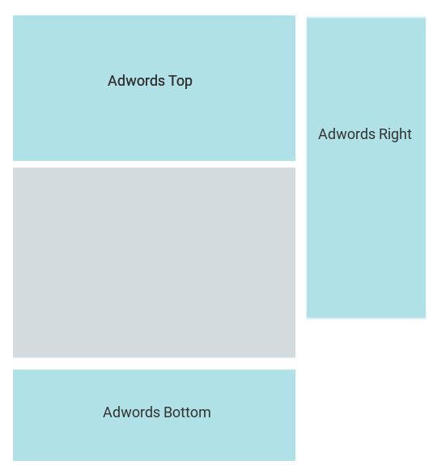

page_description: Accurate guide about how to parse a google page with SERPS - the Search Engine Spider.

# Parse a Google Page


<center>The necessary documentation about parsing a google page</center>

---

Back to the [**general google documentation**](../google.md).

---


!!! warning "Important notice about google update"
    The following examples can change at any time. 
    
    As soon as google changes its page structure, you may need to update the library.


A google SERP can contain different type of result.
Firstly they are divided in three distinct regions: **natural** (organic), **paid** (adwords) and **graph results** and each of them
has its own results types. Graph result are **not supported** by the library.

Through there is a great diversity of results the library gives you the api to work with them, here we document
how to work with it.


## Natural Results

Natural results (aka organic results) are main results of the page.

Each natural result has a position and some available data. You can access them the following way (see the foreach loop):

```php
    use Serps\SearchEngine\Google\GoogleClient;
    use Serps\SearchEngine\Google\GoogleUrl;

    $googleClient = new GoogleClient($httpClient);

    $googleUrl = new GoogleUrl();
    $google->setSearchTerm('simpsons');

    $response = $googleClient->query($googleUrl);

    $results = $response->getNaturalResults();

    foreach($results as $result){
        // Here we iterate over the result list
        // Each result will have different data based on its type
    }
```

Each of the result from the loop will have the following methods available:

- ``getTypes()``: the types of the result
- ``is($type)``: check if the result is of the given type
- ``getDataValue($type)``: Get the given data from the result. Everything accessible with ``getDataValue``
is also accessible with a property, e.g the two examples do the same thing: ``$result->getDataValue('url')`` and ``$result->url``
- ``getData()``: Get the all the data of the result
- ``getOnPagePosition()``: Get the position of the result on the page (starting at 1)
- ``getRealPosition()``: Get the global position of the result (starting at 1), that means it is aware of the pagination. **Be aware** that in some circumstances this number can be wrong because google might show more results on the previous pages.

The difference between each result type is the list of data available with ``getDataValue($type)`` and ``getData()``.
See bellow for all available data per result type.

### Natural Result Types

**Result types** can be accessed through the class ``NaturalResultType``,

```php
    use Serps\SearchEngine\Google\NaturalResultType;

    if($result->is(NaturalResultType::CLASSICAL)){
        // Do stuff
    }

    // You can also check many types at once
    // Here we check if the result is classical or image group

    if($result->is(NaturalResultType::CLASSICAL, NaturalResultType::IMAGE_GROUP)){
        // Do stuff
    }
```

From the **resultSet** you can also access all the results matching one of the given type:

```php
    // Get all the results that are either classical or image_group
    $results = $results->getResultsByType(NaturalResultType::CLASSICAL, NaturalResultType::IMAGE_GROUP);
```


#### Classical

These results are the common natural results that have always existed in google.


**Available with**

- ``NaturalResultType::CLASSICAL``

**Data**

- ``title`` <small>**string**</small> [**A**]
- ``url`` <small>**string**</small>: the url targeted on clicking the title
- ``destination`` <small>**string**</small> [**B**]: either a url or a breadcrumb-like destination
- ``description`` <small>**string**</small> [**C**]

**Example**

```php
    use Serps\SearchEngine\Google\NaturalResultType;

    $results = $response->getNaturalResults();
    
    foreach($results as $result){
        if($result->is(NaturalResultType::CLASSICAL)){
            $title = $result->title;
            $url   = $result->url;
        }
    }
```

#### Classical Large

This type an extension of the [classical result](#classical), with sitelinks in addition.


**Available with**

- ``NaturalResultType::CLASSICAL_LARGE``
- ``NaturalResultType::CLASSICAL``

**Data**

- ``title`` <small>**string**</small> [**A**]
- ``url`` <small>**string**</small>: the url targeted on clicking the title
- ``destination`` <small>**string**</small> [**B**]: either a url or a breadcrumb-like destination
- ``description`` <small>**string**</small> [**C**]
- ``sitelinks`` <small>**array**</small>:
    - ``title`` <small>**string**</small> [**D**]
    - ``url`` <small>**string**</small>: the url targeted on clicking the sitelink title
    - ``description`` <small>**string**</small> [**E**]

**Example**

```php
    use Serps\SearchEngine\Google\NaturalResultType;

    $results = $response->getNaturalResults();
    
    foreach($results as $result){
        if($result->is(NaturalResultType::CLASSICAL_LARGE)){
            $title = $result->title;
            $url   = $result->url;
            $sitelinks = $result->sitelinks;
            foreach ($sitelinks as $sitelink) {
                $sitelinkTitle = $sitelink->title;
            }
        }
    }
```

#### Classical Video

This type an extension of the [classical result](#classical), but it refers to a video result.

The video result can be illustrated with either a thumbnail or a large image.


**Available with**

- ``NaturalResultType::CLASSICAL_VIDEO``
- ``NaturalResultType::CLASSICAL``

**Data**

- ``title`` <small>**string**</small> [**A**]
- ``url`` <small>**string**</small>: the url targeted on clicking the title
- ``destination`` <small>**string**</small> [**B**]: either a url or a breadcrumb-like destination
- ``description`` <small>**string**</small> [**C**]
- ``videoLarge`` <small>**bool**</small>: true if the video is image is large (usually first result)
- ``videoCover`` <small>**string**</small>: the video picture as given by google - either an image url or a base64 encoded image

**Example**

```php
    use Serps\SearchEngine\Google\NaturalResultType;

    
    $results = $response->getNaturalResults();
    
    foreach($results as $result){
        if($result->is(NaturalResultType::CLASSICAL_VIDEO)){
            $title = $result->title;
            if($result->videoLarge){
                // ...
            }
        }
    }
```


#### Image Group

Images that appear as a group of results.


**Available with**

- ``NaturalResultType::IMAGE_GROUP``

**Data**

- ``images`` <small>**array**</small>: the list of images that compose the image group, each image contains:
    - ``sourceUrl`` <small>**string**</small>: the url where the image was found
    - ``targetUrl``<small>**string**</small>: the url reached on clicking the image
    - ``image`` <small>**string**</small>: the image data as specified by google (either an image url or a base64 encoded image)
- ``moreUrl`` <small>**string**</small>: The url corresponding to the google image search

**Example**

```php
    use Serps\SearchEngine\Google\NaturalResultType;

    
    $results = $response->getNaturalResults();
    
    foreach($results as $result){
        if($result->is(NaturalResultType::IMAGE_GROUP)){
            foreach($result->images as $image){
                $sourceUrl = $image->sourceUrl;
            }
        }
    }
```


#### Map

A result illustrated by a map and that contains sub-results.


**Available with**

- ``NaturalResultType::MAP``

**Data**

- ``localPack`` <small>**array**</small>: The sub results for the map:
    - ``title`` <small>**string**</small> **[A]**: Name of the place
    - ``url``<small>**string**</small> **[B]**: Website of the sub-result
    - ``street`` <small>**string**</small> **[C]**: The address of the sub-result
    - ``stars`` <small>**string**</small> **[D]**: The rating of the result as a number
    - ``review`` <small>**string**</small> **[E]**: The review string as specified by google (e.g '1 review')
    - ``phone`` <small>**string**</small> **[G]**: The phone number
- ``mapUrl`` <small>**string**</small> **[F]**: The url to access the map search

**Example**

```php
    use Serps\SearchEngine\Google\NaturalResultType;

    
    $results = $response->getNaturalResults();
    
    foreach($results as $result){
        if($result->is(NaturalResultType::MAP)){
            foreach($result->localPack as $place){
                $website = $place->website;
            }
        }
    }
```


#### Answer Box

Block that answers a question asked by the keywords.


**Available with**

- ``NaturalResultType::ANSWER_BOX``

**Data**

- ``title`` <small>**string**</small> [**A**]
- ``url`` <small>**string**</small>: the url targeted on clicking the title
- ``destination`` <small>**string**</small> [**B**]: either a url or a breadcrumb-like destination
- ``description`` <small>**string**</small> [**C**]

**Example**

```php
    use Serps\SearchEngine\Google\NaturalResultType;

    $results = $response->getNaturalResults();
    
    foreach($results as $result){
        if($result->is(NaturalResultType::ANSWER_BOX)){
            $title = $result->title;
            $url   = $result->url;
        }
    }
```

#### Tweet Carousel

Recent tweet list from an user matching the search keywords.


**Available with**

- ``NaturalResultType::TWEETS_CAROUSEL``

**Data**

- ``title`` <small>**string**</small> **[A]**
- ``url`` <small>**string**</small>: The url reach when clicking the title
- ``user``<small>**string**</small>: The author of the tweets

**Example**

```php
    use Serps\SearchEngine\Google\NaturalResultType;

    
    $results = $response->getNaturalResults();
    
    foreach($results as $result){
        if($result->is(NaturalResultType::TWEETS_CAROUSEL)){
            $user = $result->user;
        }
    }
```

#### In the News

Recent news results.


**Available with**

- ``NaturalResultType::IN_THE_NEWS``

**Data**

- ``news`` <small>**array**</small>
    - ``title`` <small>**string**</small> **[A]**
    - ``description`` <small>**string**</small> **[B]**
    - ``url``<small>**string**</small>: The url reached when clicking the title

**Example**

```php
    use Serps\SearchEngine\Google\NaturalResultType;

    
    $results = $response->getNaturalResults();
    
    foreach($results as $result){
        if($result->is(NaturalResultType::IN_THE_NEWS)){
            foreach($result->news as $news){
                $newsTitle = $title;
                $newsUrl = $url;
            }
        }
    }
```


#### Flights

Flight sample from google flights


**Available with**

- ``NaturalResultType::FLIGHTS``

**Data**

No data is parsed from flight results. There is no plan to implement it because it's complex and not very useful.

**Example**

```php
    use Serps\SearchEngine\Google\NaturalResultType;

    $results = $response->getNaturalResults();
    
    foreach($results as $result){
        if($result->is(NaturalResultType::FLIGHTS)){
            // Got a flight result
        }
    }
```


## Adwords Results

The google client offers an Adwords parser.

!!! Warning 
    Adwords parsing is still experimental!

```php
    $adwordsResults = $response->getAdwordsResults();
    
    foreach($results as $result){
        // do stuff
    }
```

### Adwords sections

Adwords results are composed from 3 distinct sections. These sections can be at the top, at the right or at the bottom
of the natural results. See the schema:




By default all results are available in the result set, if you need 
to get results from a section, you can use the section as a type filter:

```php
    use Serps\SearchEngine\Google\AdwordsResultType;

    $adwordsResults = $response->getAdwordsResults();
    
    $topResults = $adwordsResults->getResultsByType(AdwordsResultType::SECTION_TOP);
    $rightResults = $adwordsResults->getResultsByType(AdwordsResultType::SECTION_RIGHT);
    $bottomResults = $adwordsResults->getResultsByType(AdwordsResultType::SECTION_BOTTOM);
    
    foreach($topResults as $result){
        // Do stuff...
    }
```

### Adwords Types

#### Ad


Ads results are the basics results from adwords.


**Available with**

- ``AdwordsResultType::AD``

**Data**

- ``title`` <small>**string**</small> **[A]**
- ``url`` <small>**string**</small>: The url reach when clicking the title
- ``visurl`` <small>**string**</small> **[B]**: The visual url
- ``description``<small>**string**</small> **[C]**

**Example**

```php
    use Serps\SearchEngine\Google\AdwordsResultType;

    
    $results = $response->getAdwordsResults();
    
    foreach($results as $result){
        if($result->is(AdwordsResultType::AD)){
            $url = $result->url;
        }
    }
```

#### Shopping


These are the results from google shopping/merchant.


**Available with**

- ``AdwordsResultType::SHOPPING_GROUP``

**Data**

- ``products`` <small>**array**</small>: The product list. Each product contains the following items:
    - ``title`` <small>**string**</small> **[A]**
    - ``image`` <small>**string**</small> **[B]**: the image as specified by google - either an image url or a base64 encoded image
    - ``url`` <small>**string**</small>: The url reached when clicking the title
    - ``target`` <small>**string**</small> **[C]**: The target website as shown by google
    - ``price``<small>**string**</small> **[D]**: The price as show by google

**Example**

```php
    use Serps\SearchEngine\Google\AdwordsResultType;
    
    $results = $response->getAdwordsResults();
    
    foreach($results as $result){
        if($result->is(AdwordsResultType::SHOPPING_GROUP)){
            foreach($result->products as $item){
                $title = $item->title;
            }
        }
    }
```


## Additional info

A Google SERP contains even more information that the result list. Sometime they will be very helpful to get the
most from the SERP.

Here is the list of these info currently supported by the parser.


### Number of results


Represents the total number of results returned by the current search. 
The format of this number can change from country to country (61,000,000 or 61 000 000 or 6,10,00,000 etc...) 
We take care of returning this number as a integer no matter the initial format.

In some cases this number is not available (for instance with mobile layout)

```php
    $numberOfResults = $response->getNumberOfResults();
    
    if(null === $numberOfResults){
        // houston, we have a problem...
    } elseif($numberOfResults > 2000) {
        // not so many
    } else {
        // a way too much
    }
``` 

### Related searches


Google uses to give a list of related searches at the bottom of the page. The method ``getRelatedSearches`` will return a list of these items.

```php
    $relatedSearches = $response->getRelatedSearches();
    foreach ($relatedSearches as $relatedSearch) {
        $url = $relatedSearch->url;
        $title = $relatedSearch->title;
    }
```


## Custom parsing

Sometimes you need information that are not available in our parser. 

First of all, search if someone already asked for this feature 
on the [issue tracker](https://github.com/serp-spider/search-engine-google/issues). 

If you don't find a trace of this feature, but you still consider that this feature is important, then open an issue and
let's discuss it. This is very important because if the feature is implemented in the library it will take advantage of
being updated on google updates, and you wont have to maintain it.


------ 

Back from the issue tracker, no one mentioned it and you still **want to parse the information by yourself**.
 Alright, here are the tools you need.

### Query with css

The easiest way to do it for a web developer: **with css**.

```php
    $response = $googleClient->query($googleUrl);

    // Returns \DOMNodeList
    $queryResult = $response->cssQuery('#someId');
    
    if ($queryResult->length == 1) {
        // You can query again to find items in the previous context.
        
        // Gets all items with the class 'someClass' within the element with the id 'someId'
        $queryResult = $response->cssQuery('.someClass', $queryResult->item(0));
    } else {
        // some errors...
    }
```

It works exactly as [DOMXPath::query](http://php.net/manual/fr/domxpath.query.php) does. Actually the css is translated 
to xpath and [DOMXPath::query](http://php.net/manual/fr/domxpath.query.php) is called on the dom element.


### Query with xpath

That's very similar to the css way, except that you will use **xpath**.

```php
    $response = $googleClient->query($googleUrl);

    $queryResult = $response->xpathQuery('descendant::div[@id="someId"]');
    
    if ($queryResult->length == 1) {
        // Gets all 'a' tags inside the element with the id 'someId'.
        $queryResult = $response->xpathQuery('a', $queryResult->item(0));
    } else {
        // some errors...
    }
```

There is also a shortcut to the xpath object.

```php
    $response = $googleClient->query($googleUrl);

    $xpath = $response->getXpath();
    $xpath->query('someXpath');
```

### Manipulate the DOM object

You can get the [DOM object](http://php.net/manual/fr/class.domdocument.php) to manipulate it, or to save it in a file.

```php
    $response = $googleClient->query($googleUrl);
    
    $dom = $response->getDom();
    
    // Writes the dom content in the file 'file.html'
    $dom->save('file.html');
```
